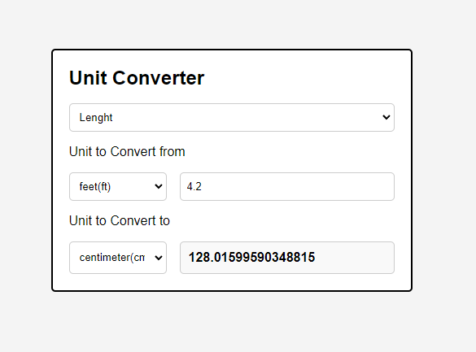

# Unit Converter - Challengue from [Roadmap.sh](https://roadmap.sh/projects/unit-converter) 

This project is a web-based **Unit Converter** application that allows users to convert values between various units of measurement, including temperature, weight, and length. 



## Features
- **Dynamic Unit Selection:**
  - Automatically updates the units available for conversion based on the selected measurement type.
- **Real-Time Conversion:**
  - Converts values dynamically as the user inputs data or changes conversion parameters.
- **Support for Multiple Measurement Types:**
  - Temperature (Celsius, Fahrenheit, Kelvin).
  - Weight (Pounds, Kilograms, Ounces, Grams).
  - Length (Inches, Centimeters, Feet, Meters, Miles, Kilometers, Yards, Millimeters).

---

## Project Structure

```plaintext
project-directory/
├── index.html       # Main HTML file
├── styles.css       # CSS file for styling
├── script.js        # JavaScript file containing the core logic
├── data.js          # JavaScript file with unit data
```

---

## Getting Started

### Prerequisites
To run this project locally, ensure you have a modern web browser installed.

### Installation
1. Clone this repository or download the project files.
2. Open `index.html` in your web browser.

---

## Files Overview

### 1. `index.html`
This is the main structure of the Unit Converter application. It contains:
- A dropdown for selecting the measurement type.
- Input fields for entering values and selecting units to convert from/to.
- A dynamic section to display the converted value.

### 2. `styles.css`
This file styles the application layout and elements, ensuring a user-friendly interface.

### 3. `script.js`
Contains the core logic for:
- Populating dropdown menus with data.
- Handling user interactions.
- Performing unit conversions.

### 4. `data.js`
Stores the data structure for:
- Measurement types (Temperature, Weight, Length).
- Corresponding units and their conversion factors.

---

## Conversion Logic

### Temperature Conversion
The function `convertTemperature(fromUnit, toUnit, input)` handles temperature conversion using these formulas:
- Celsius (°C) to Fahrenheit (°F): `(input * 9 / 5) + 32`
- Celsius (°C) to Kelvin (K): `input + 273.15`
- Reverse conversions are handled accordingly.

### Weight and Length Conversion
The function `convertWeightOrLength(fromUnit, toUnit, input)` uses conversion factors for precise transformations.
- Converts the input to a reference unit, then multiplies by the target unit's factor.

---

## Event Handling
The script listens for user interactions, including:
- Page load: Populates measurement options.
- Dropdown changes: Updates available units dynamically.
- Input updates: Recalculates conversion values in real-time.

### Event Listeners
- **`DOMContentLoaded`**: Calls `chargeMeasures()` to populate measurement types.
- **`measure.change`**: Updates unit options.
- **`convertFrom.change`, `convertTo.change`, `valueToConvert.input`**: Triggers `convertValue()` to perform calculations.

---

## Data Structure
The `data.js` file contains structured information for all supported units:

```json
[
  {
    "key": "0",
    "measure": "Temperature",
    "units": [
      {"key": "Celsius (C)", "value": "c"},
      {"key": "Fahrenheit (F)", "value": "f"},
      {"key": "Kelvin (K)", "value": "k"}
    ]
  },
  {
    "key": "1",
    "measure": "Weight",
    "units": [
      {"key": "Pound (lb)", "value": "lb", "conversionFactor": 2.20462},
      {"key": "Kilogram (kg)", "value": "kg", "conversionFactor": 1},
      {"key": "Ounce (oz)", "value": "oz", "conversionFactor": 35.274},
      {"key": "Gram (g)", "value": "g", "conversionFactor": 1000}
    ]
  },
  {
    "key": "2",
    "measure": "Length",
    "units": [
      {"key": "Inch (in)", "value": "in", "conversionFactor": 39.3700787},
      {"key": "Centimeter (cm)", "value": "cm", "conversionFactor": 100},
      {"key": "Feet (ft)", "value": "ft", "conversionFactor": 3.28084},
      {"key": "Meter (m)", "value": "m", "conversionFactor": 1}
    ]
  }
]
```

---

## Example Usage
1. Open the application.
2. Select a measurement type (e.g., Temperature).
3. Enter a value to convert and select the units (e.g., Celsius to Fahrenheit).
4. View the converted value in real-time.

---

## Possible Enhancements
- Add more measurement categories (e.g., Volume, Speed).
- Implement error handling for invalid inputs.
- Style the application for better user experience.

---

## Documentation
This README file was powered by ChatGPT.
